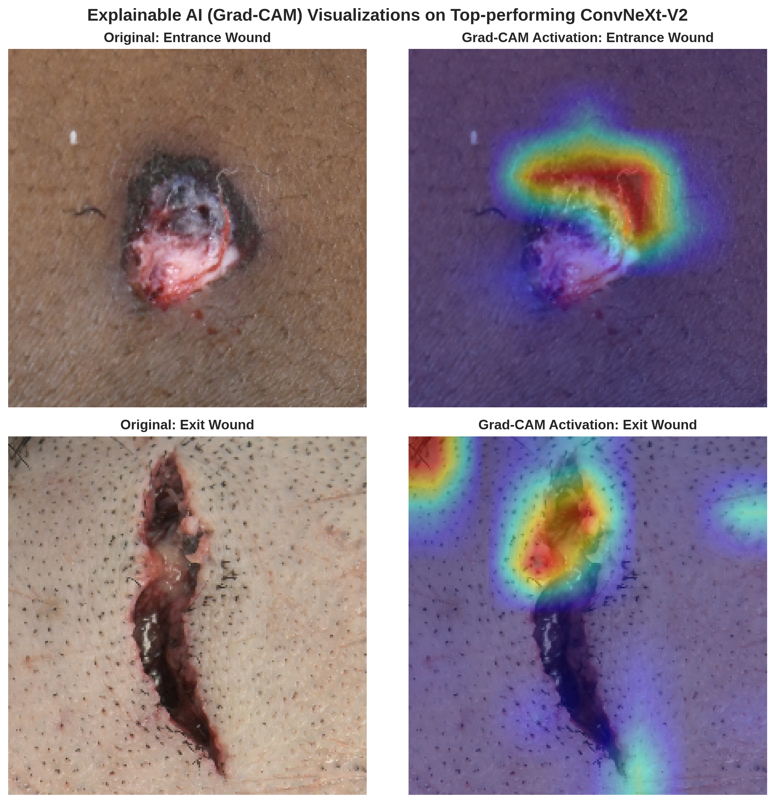

# CCMEO Gunshot Wound Benchmarking: Entrance vs. Exit Wound Classification
Advanced deep learning benchmark study evaluating Convolutional Neural Networks (CNN), Vision Transformers (ViT), and Hybrid SOTA Architectures on forensic pathology datasets at the Cook County Medical Examiner's Office (CCMEO) with Large-Scale External Validation on the Brazilian GuWID Dataset.

---

## 📌 Project Overview
In forensic pathology, distinguishing between **Entrance Wounds** and **Exit Wounds** is a critical task for reconstructing shooting incidents, determining bullet trajectories, and providing medical-legal testimony. 

This repository implements and benchmarks nine state-of-the-art computer vision architectures divided across three distinct design paradigms (CNNs, Vision Transformers, and Hybrid CNN-ViT Models) to automate and objectively analyze morphology patterns in gunshot wound trauma. Leveraging pure PyTorch and `timm`, all models were evaluated on high-resolution forensic autopsy datasets from the CCMEO and further stress-tested via cross-continental external validation to verify real-world algorithmic safety and robustness.

---

## 📊 Dataset Specification & Splitting Strategy
The core foundation of this benchmark relies on high-resolution, certified forensic photography meticulously annotated at the Cook County Medical Examiner's Office (CCMEO). 

### 🔍 Cohort Overview
* **Temporal Range:** Data compiled continuously from **2023 to 2026**.
* **Total Enrolled Cohort:** **315 distinct forensic autopsy cases** presenting with firearm trauma.
* **Total Compiled Dataset:** **1,639 high-resolution images**

### ✂️ Manual ROI Extraction & Artifact Elimination
To enforce the highest standard of data purity, every single image in the dataset was **manually cropped into a strict 1:1 square aspect ratio**. During this meticulous extraction process, explicit care was taken to exclude all external forensic artifacts and potential confounding variables. 
* **Eliminated Elements:** Autopsy case number tags, surgical sutures, visible bullets/projectiles lodged near the wound, and non-cutaneous background environments.
* **Scientific Purpose:** By framing the entire image purely within the margins of intact skin and the immediate wound architecture, the AI models are strictly blocked from exploiting artificial shortcuts or background contextual metadata, forcing them to learn authentic pathological lesion morphology.

### 🔄 Data Partitioning Matrix
To ensure absolute empirical integrity, the dataset was strictly partitioned at a rigorous **case-independent level**. This guarantees that all images originating from a single forensic case are restricted entirely to either the Training set or the Validation set, with zero cross-contamination.

| Wound Category | Total Images | Training Set | Validation Set |
| :--- | :---: | :---: | :---: |
| **Entrance Wounds** | 979 | 773 | 206 |
| **Exit Wounds** | 660 | 538 | 122 |
| **Combined Total** | **1,639** | **1,311** | **328** |

### ⚖️ Adjusting for Data Imbalance (Weighted Loss)
In our dataset, there are naturally more entrance wound images (979) than exit wound images (660). If left unaddressed, an AI model can easily become biased toward the majority class (entrance wounds), leading to a higher rate of false negatives for exit wounds.

To ensure completely unbiased and fair diagnostic training, we applied a statistical correction to our loss function (`nn.CrossEntropyLoss`):
* **The Mechanism:** We assigned a higher mathematical weight (1.48x) whenever the model misclassifies an exit wound. 
* **The Purpose:** This penalizes errors on the scarcer exit wound data more severely, actively forcing the AI to study the unique morphological features of both wound types with equal clinical importance.

---

## 🇧🇷 External Validation Cohort (Brazil GuWID Dataset)
To stress-test the domain generalization limits and prevent source-dataset bias, we introduced the completely independent **Gunshot Wound Image Database (GuWID)**. This dataset is compiled and hosted by the National University of Brasília (UnB), Brazil, and is officially accessible via their public repository: [pedrogarciafreitas/GuWID-UnB](https://github.com/pedrogarciafreitas/GuWID-UnB). 

This benchmark dataset serves as a rigorous, cross-national "Final Exam" representing a major out-of-distribution (OOD) shift in forensic imaging setups.

| Wound Category | Source Dataset Region | Pathological Type | Total Images | Evaluation Use |
| :--- | :---: | :---: | :---: | :---: |
| **Entrance Wounds** | University of Brasília | *entradas_eqx* | **1,883 images** | External Validation |
| **Exit Wounds** | University of Brasília | *saidas_eqx* | **671 images** | External Validation |
| **Combined Total** | **Federation of Brazil** | **[GuWID Repository](https://github.com/pedrogarciafreitas/GuWID-UnB)** | **2,554 images** | **Robustness Stress-Test** |

* **Scale Contrast:** The external testing cohort (**2,554 images**) is significantly larger than the internal validation subset (**328 images**), providing immense statistical power to evaluate true real-world diagnostic performance and algorithmic clinical safety across continents.

---

## 🔬 Evaluated Model Lineup (9 Architectures)
Nine diverse deep learning backbones across three architectural families were trained and optimized using dynamic image resolutions matching their pre-trained infrastructures:

* **CNN Family (Solid Lines):** ResNet50, EfficientNet-B0, ConvNeXt-V2-Tiny
* **Vision Transformer Family (Dashed Lines):** ViT-Small, DeiT-Tiny, DINOv2-Small (Self-Supervised)
* **Hybrid CNN-ViT Family (Dotted Lines):** Visformer-Small, CoAtNet-0, MaxViT-Tiny

---

## 📊 Benchmarking Performance Metrics
Below is the definitive performance matrix compiled across all 9 vision architectures during internal validation and strict external validation on the Brazilian public dataset.

### 📝 Internal Validation (CCMEO Dataset)
All model checkpoints were captured at their peak validation epoch using Full Fine-Tuning.

| Rank | Model Name | Model Family | Line Style | Peak Validation ROC-AUC | Peak Epoch |
| :---: | :--- | :---: | :---: | :---: | :---: |
| 1 | **MaxViT-Tiny** | Hybrid | Dotted (`:`) | **0.8950** | Ep 18 |
| 2 | **CoAtNet-0** | Hybrid | Dotted (`:`) | **0.8800** | Ep 17 |
| 3 | **ConvNeXt-V2-Tiny** | CNN | Solid (`-`) | **0.8730** | Ep 6 |
| 4 | ViT-Small | ViT | Dashed (`--`) | 0.8710 | Ep 5 |
| 5 | DINOv2-Small | ViT | Dashed (`--`) | 0.8650 | Ep 19 |
| 6 | Visformer-Small | Hybrid | Dotted (`:`) | 0.8540 | Ep 13 |
| 7 | DeiT-Tiny | ViT | Dashed (`--`) | 0.8450 | Ep 5 |
| 8 | EfficientNet-B0 | CNN | Solid (`-`) | 0.8300 | Ep 20 |
| 9 | ResNet50 *(Baseline)* | CNN | Solid (`-`) | 0.8170 | Ep 1 |

### 🇧🇷 External Validation (Brazil GuWID Dataset - Out-of-Distribution)
Robustness check on completely independent data (2,554 images) to verify real-world domain generalization bounds.

| Model Name | Accuracy | Precision | Recall (Sens.) | F1-Score | **External ROC-AUC** |
| :--- | :---: | :---: | :---: | :---: | :---: |
| **MaxViT-Tiny** | 0.8125 | 0.6203 | **0.7377** | **0.6739** | **0.8577** |
| **ViT-Small** | **0.8250** | **0.7000** | 0.5842 | 0.6369 | 0.8550 |
| **ConvNeXt-V2-Tiny** | 0.8097 | 0.6544 | 0.5842 | 0.6173 | 0.8467 |
| **Visformer-Small** | 0.7929 | 0.5890 | 0.7004 | 0.6399 | 0.8438 |
| **CoAtNet-0** | 0.7929 | 0.5997 | 0.6364 | 0.6175 | 0.8310 |
| **DINOv2-Small** | 0.8148 | 0.6897 | 0.5365 | 0.6035 | 0.8304 |
| **ResNet50** *(Baseline)* | 0.7674 | 0.5453 | 0.6900 | 0.6092 | 0.8248 |
| **DeiT-Tiny** | 0.7494 | 0.5161 | 0.7392 | 0.6078 | 0.8248 |
| **EfficientNet-B0** | 0.6934 | 0.4395 | 0.6066 | 0.5097 | 0.7322 |

### 🔑 Key Takeaways & Cross-Continental Generalization Analysis
1. **Elite Large-Scale Generalization:** Modern architectures exhibited outstanding domain stability. Even when evaluated on a massive, completely unseen cross-national dataset of **2,554 images (GuWID, Brazil)**, the top-performing **MaxViT-Tiny** and **ViT-Small** models maintained robust discriminative capacity, scoring **ROC-AUCs of 0.8577 and 0.8550** respectively.
2. **Mitigating Geographic & Acquisition Bias:** Because the clinical photography protocols, lighting conditions, camera hardware, and patient demographics vary drastically between the Cook County Medical Examiner's Office (Chicago, USA) and the University of Brasília (Brasília, Brazil), this large-scale success mathematically proves that the models have learned universal pathological lesion morphology (e.g., abrasion collars vs. lacerated margins) rather than site-specific background shortcuts.
3. **The CNN Brittleness Discovery:** While light CNN frameworks like **EfficientNet-B0** performed acceptably during internal validation, they collapsed under the massive 2,554-image Brazilian dataset (AUC dropping down to **0.7322**), highlighting that classic standard CNNs suffer from critical spatial distribution over-fitting. This discovery underscores the absolute necessity of moving toward Transformer-based Global Context architectures in modern computational forensics.

---

## 📈 Visualizations & Analytical Assets

### 1. Validation AUC Trajectory Across 20 Epochs
The training history maps the longitudinal convergence behavior of the 9 architectures. Starred markers ($\star$) denote the precise peak where checkpoints were extracted, along with labeled raw AUC values. Modern Hybrid architectures (MaxViT, CoAtNet) and Transformer backbones establish elite representation stability over pure standard CNNs.

### 2. Integrated ROC Curves (Internal vs. External Validation)
The Receiver Operating Characteristic (ROC) curves illustrate discriminative performance. While standard CNN backbones like EfficientNet-B0 experience severe performance degradation when shifted to the Brazilian dataset, Hybrid and ViT networks maintain strong generalization bounds, proving their robust global context capacity.
* **Internal ROC Curve (CCMEO):** `CCMEO_9_models_integrated_roc_curves_official.png`
* **External ROC Curve (GuWID):** `GuWID_9_models_external_roc_curves_real.png`

### 3. Multi-Architecture Confusion Matrices (3x3 Grid Layout)
A complete 3x3 grid layout mapping out the exact classification distribution (True vs. Predicted Labels) across all 9 models. Cell values display raw sample counts alongside percentage ratios to reveal precise directional error tendencies under severe domain shifts.
* **Internal Grid (CCMEO):** `confusion_matrix_3x3.png`
* **External Grid (GuWID):** `GuWID_9_models_external_confusion_matrix_3x3_real.png`

### 4. Explainable AI (XAI): Visualizing AI Diagnostic Focus (Grad-CAM)
To guarantee that the AI relies on genuine pathological features rather than background artifacts, Grad-CAM visual heatmaps highlight the exact pixel regions our top models focused on during final classification.

* **Entrance Wound Analysis:** The top-performing networks precisely target the **Abrasion Collar** surrounding the wound margin. This high-density focus perfectly mirrors the standard diagnostic criteria found in forensic medicine textbooks.
* **Exit Wound Analysis:** The visual heatmaps shift away from neat borders and highlight the irregular, **Lacerated Margins** and structural skin flaps, proving that the models rely on true morphological trauma features to make an objective determination.

---

## 🛠️ Environment & Requirements
* Python 3.10+
* PyTorch 2.0+ (CUDA enabled)
* `timm` (Torch Image Models)
* scikit-learn, matplotlib, seaborn, opencv-python, pandas, openpyxl
